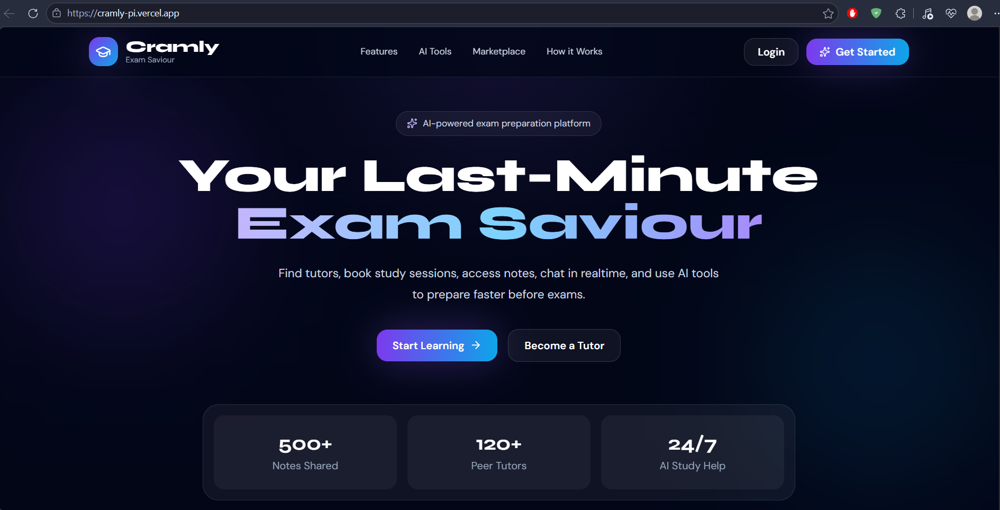
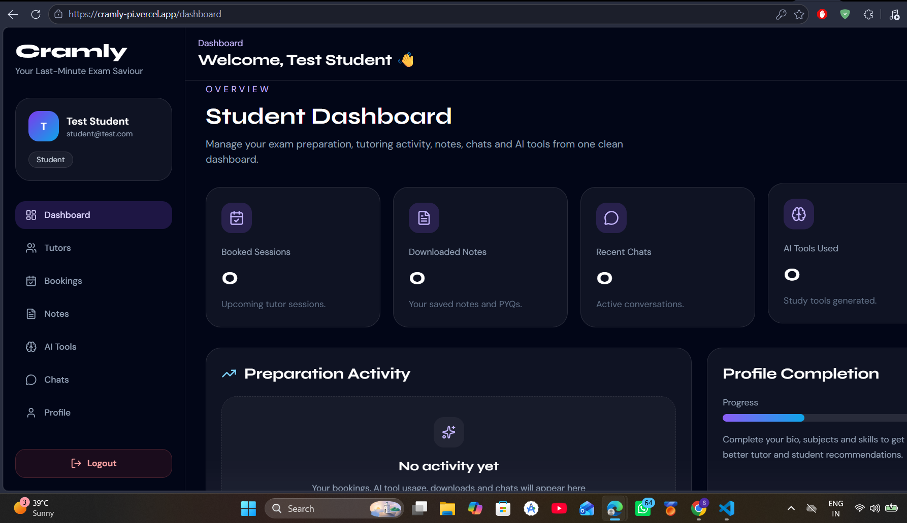
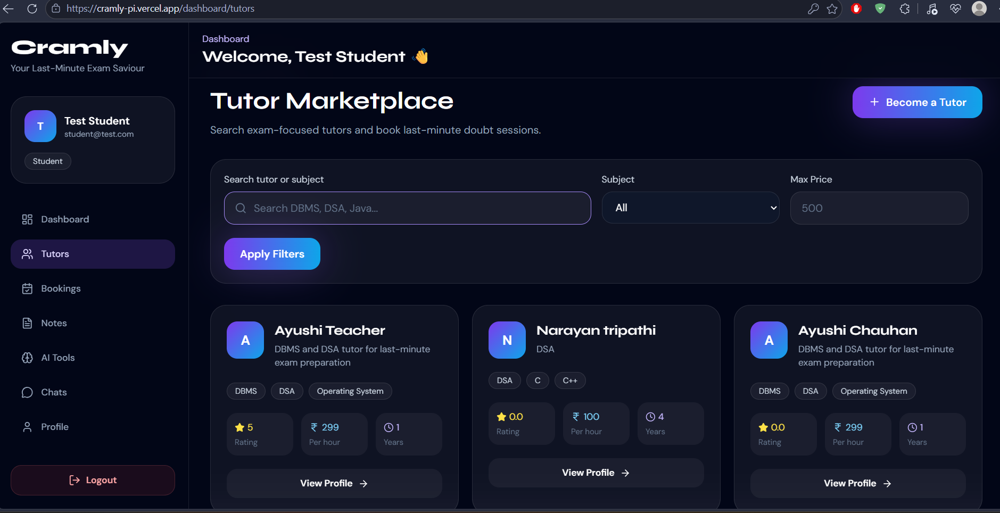
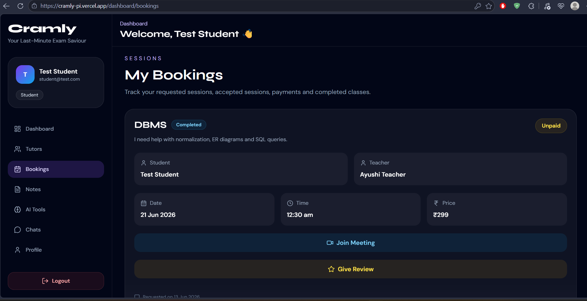
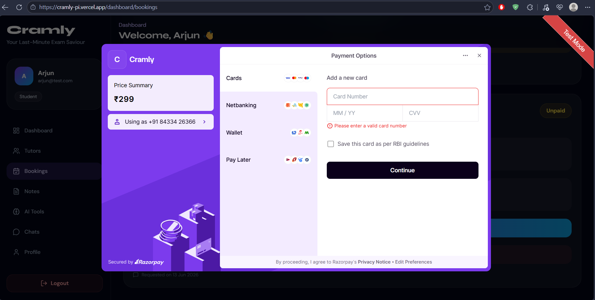
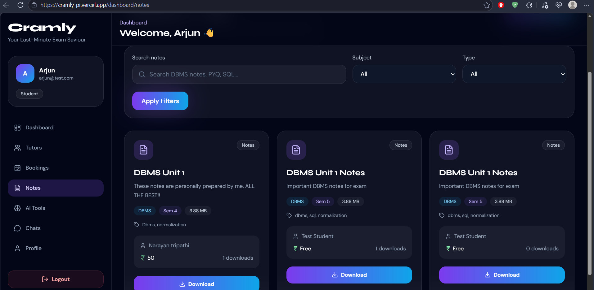
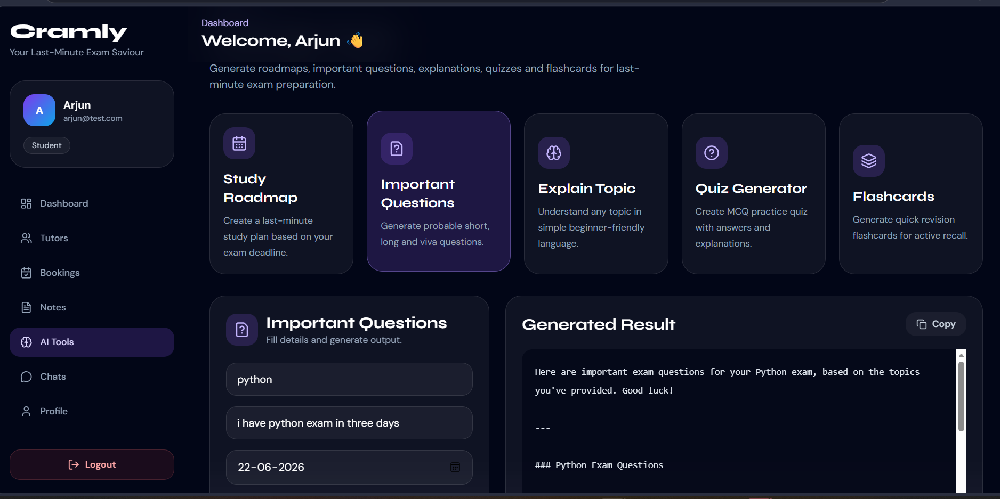
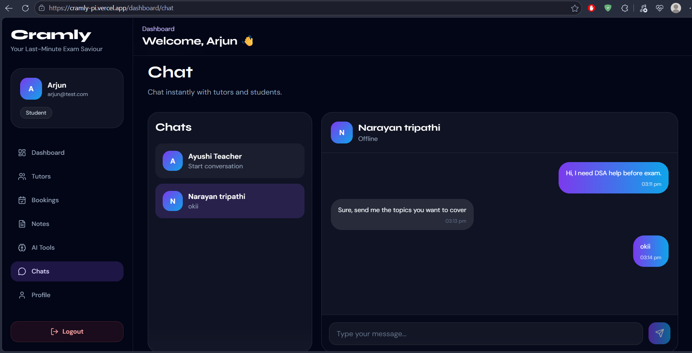
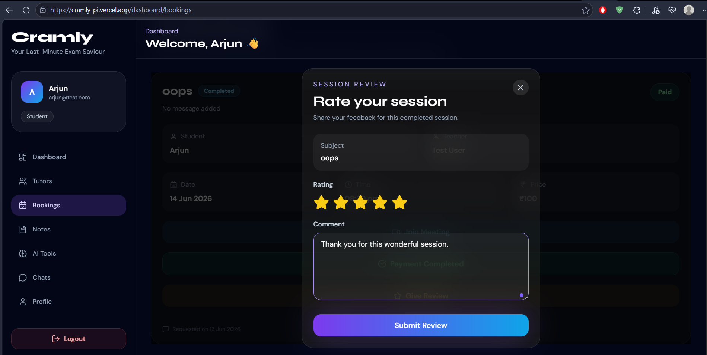

# Cramly — AI-Powered Full-Stack Learning Marketplace

Cramly is an **AI-powered full-stack MERN learning marketplace** built for students who need quick academic help, study resources, and last-minute exam preparation support.

It combines a peer-to-peer tutor marketplace, session booking system, real-time chat, notes/PYQ sharing, Razorpay test payments, reviews and ratings, and Gemini-powered AI study tools into one complete platform.

The project is designed as a real-world full-stack application with authentication, role-based access, backend APIs, database models, cloud file upload, payment integration, socket-based chat, AI integration, and production deployment.

---

## Live Demo

**Frontend:** https://cramly-pi.vercel.app
**Backend API:** https://cramly-backend.onrender.com
**Backend Health Check:** https://cramly-backend.onrender.com/api/health

> Note: The backend is hosted on Render free tier, so the first request may take a few seconds if the server is waking up after inactivity.

---

## Demo Credentials

### Student Account

```txt
Email: student@test.com
Password: 123456
```

### Teacher Account

```txt
Email: teacher@test.com
Password: 123456
```

You can also create a new account from the application.

---

## Project Overview

Cramly helps students prepare better by allowing them to:

* Find peer tutors for last-minute academic help
* Book paid or free learning sessions
* Chat with tutors in real time
* Upload and download notes, PDFs, and PYQs
* Generate AI-powered study roadmaps, quizzes, flashcards, and important questions
* Pay for sessions using Razorpay test checkout
* Give reviews and ratings after completed sessions

The goal of this project was to build a **complete full-stack product**, not just a basic CRUD app.

---

## Why This Project Stands Out

This project includes multiple real-world production-style modules:

* Full-stack MERN architecture
* JWT authentication and protected routes
* Student and teacher role-based workflows
* Real-time chat using Socket.IO
* Cloud file upload using Cloudinary
* AI study tools using Gemini API
* Razorpay test payment gateway integration
* Review and rating system
* MongoDB Atlas database integration
* Deployed backend and frontend
* Clean API-based architecture

---

## Key Features

### 1. Authentication and Authorization

* User registration and login
* JWT-based authentication
* Password hashing using bcrypt
* Protected backend routes
* Protected frontend dashboard routes
* Student and teacher role support
* Persistent login using local storage

---

### 2. Student and Teacher Dashboard

* Role-based dashboard experience
* Sidebar navigation
* User profile card
* Quick access to tutors, bookings, notes, AI tools, chat, and profile
* Clean dashboard layout for managing learning activities

---

### 3. Tutor Marketplace

* Teachers can create tutor profiles
* Students can browse all available tutors
* Tutor cards show name, subjects, price, rating, and profile details
* Students can view tutor profiles
* Students can request a session directly from a tutor
* Search and filter support for easier tutor discovery

---

### 4. Session Booking System

* Students can book sessions with tutors
* Teachers can accept or reject session requests
* Teachers can mark sessions as completed
* Students can cancel active bookings
* Booking statuses include pending, accepted, completed, cancelled, and rejected
* Meeting link support for accepted sessions

---

### 5. Razorpay Test Payment Integration

* Razorpay test checkout integration
* Backend creates Razorpay orders
* Frontend opens Razorpay checkout
* Backend verifies Razorpay payment signature
* Payment status is stored in MongoDB
* Paid and unpaid booking states are shown in the UI
* Test mode is used, so no real money is involved

---

### 6. Notes and PYQ Marketplace

* Users can upload study notes, PDFs, and PYQs
* Files are uploaded using Cloudinary
* Notes include subject, semester, type, tags, price, and uploader details
* Users can download study material
* Download count is tracked
* Owners can delete their uploaded notes
* Marketplace shows resources uploaded by different users

---

### 7. Real-Time Chat

* Real-time messaging using Socket.IO
* Students can start conversations with tutors
* Conversation list and chat window
* Messages update instantly
* Socket connection and disconnection handling
* Useful for doubt-solving before and after booked sessions

---

### 8. AI Study Tools

Cramly includes Gemini-powered AI tools for exam preparation.

AI tools include:

* Study Roadmap Generator
* Important Questions Generator
* Topic Explainer
* Quiz Generator
* Flashcard Generator

These tools help students quickly prepare for exams by generating structured, simple, and exam-focused study content.

This makes Cramly not only a full-stack project, but also an **AI-integrated learning platform**.

---

### 9. Reviews and Ratings

* Students can review completed sessions
* One review is allowed per completed booking
* Ratings are given from 1 to 5 stars
* Review comments are stored in MongoDB
* Tutor and teacher average ratings update automatically
* Helps build trust in the tutor marketplace

---

## Tech Stack

### Frontend

* React.js
* Vite
* Tailwind CSS
* React Router
* Axios
* Socket.IO Client
* React Hot Toast
* Lucide React Icons
* Razorpay Checkout

### Backend

* Node.js
* Express.js
* MongoDB
* Mongoose
* JWT
* Bcrypt.js
* Socket.IO
* Multer
* Cloudinary
* Razorpay SDK
* Gemini API
* Express Async Handler

### Deployment and Cloud Services

* Frontend: Vercel
* Backend: Render
* Database: MongoDB Atlas
* File Storage: Cloudinary
* AI: Gemini API
* Payments: Razorpay Test Mode

---

## Screenshots


### Landing Page



### Dashboard



### Tutor Marketplace



### Session Bookings



### Razorpay Test Payment



### Notes and PYQ Marketplace



### AI Study Tools



### Real-Time Chat



### Reviews and Ratings



---

## Project Structure

```txt
cramly
├── backend
│   ├── config
│   │   ├── cloudinary.js
│   │   ├── db.js
│   │   ├── gemini.js
│   │   └── razorpay.js
│   ├── controllers
│   │   ├── aiController.js
│   │   ├── authController.js
│   │   ├── bookingController.js
│   │   ├── chatController.js
│   │   ├── noteController.js
│   │   ├── paymentController.js
│   │   ├── reviewController.js
│   │   └── tutorController.js
│   ├── middleware
│   │   ├── authMiddleware.js
│   │   ├── errorMiddleware.js
│   │   └── uploadMiddleware.js
│   ├── models
│   │   ├── bookingModel.js
│   │   ├── conversationModel.js
│   │   ├── messageModel.js
│   │   ├── noteModel.js
│   │   ├── reviewModel.js
│   │   ├── tutorModel.js
│   │   └── userModel.js
│   ├── routes
│   │   ├── aiRoutes.js
│   │   ├── authRoutes.js
│   │   ├── bookingRoutes.js
│   │   ├── chatRoutes.js
│   │   ├── noteRoutes.js
│   │   ├── paymentRoutes.js
│   │   ├── reviewRoutes.js
│   │   └── tutorRoutes.js
│   ├── sockets
│   │   └── socketHandler.js
│   ├── utils
│   │   ├── apiResponse.js
│   │   └── generateToken.js
│   └── server.js
│
├── frontend
│   ├── public
│   └── src
│       ├── components
│       │   ├── ai
│       │   ├── bookings
│       │   ├── chat
│       │   ├── layout
│       │   ├── notes
│       │   ├── reviews
│       │   ├── tutors
│       │   └── ui
│       ├── hooks
│       ├── pages
│       ├── routes
│       ├── services
│       ├── store
│       ├── utils
│       ├── App.jsx
│       ├── index.css
│       └── main.jsx
│
├── screenshots
└── README.md
```

---

## Environment Variables

Real `.env` files are not pushed to GitHub.
Only `.env.example` files should be committed.

---

### Backend Environment Variables

Create:

```txt
backend/.env
```

Add:

```env
PORT=5000
NODE_ENV=development

MONGO_URI=your_mongodb_atlas_connection_string

JWT_SECRET=your_jwt_secret
JWT_EXPIRES_IN=30d

CLIENT_URL=http://localhost:5173

CLOUDINARY_CLOUD_NAME=your_cloudinary_cloud_name
CLOUDINARY_API_KEY=your_cloudinary_api_key
CLOUDINARY_API_SECRET=your_cloudinary_api_secret

GEMINI_API_KEY=your_gemini_api_key
GEMINI_MODEL=gemini-2.5-flash

RAZORPAY_KEY_ID=your_razorpay_test_key_id
RAZORPAY_KEY_SECRET=your_razorpay_test_key_secret
```

---

### Frontend Environment Variables

Create:

```txt
frontend/.env
```

Add:

```env
VITE_API_URL=http://localhost:5000/api
VITE_SOCKET_URL=http://localhost:5000
VITE_RAZORPAY_KEY_ID=your_razorpay_test_key_id
```

---

## Local Setup

### 1. Clone the repository

```bash
git clone https://github.com/Ayushi-2564/Cramly.git
cd Cramly
```

---

### 2. Install backend dependencies

```bash
cd backend
npm install
```

---

### 3. Start backend server

```bash
npm run dev
```

Backend runs on:

```txt
http://localhost:5000
```

Health check:

```txt
http://localhost:5000/api/health
```

---

### 4. Install frontend dependencies

Open another terminal:

```bash
cd frontend
npm install
```

---

### 5. Start frontend

```bash
npm run dev
```

Frontend runs on:

```txt
http://localhost:5173
```

---

## API Overview

### Auth APIs

```txt
POST   /api/auth/register
POST   /api/auth/login
GET    /api/auth/me
PUT    /api/auth/profile
POST   /api/auth/logout
```

### Tutor APIs

```txt
GET    /api/tutors
GET    /api/tutors/me
POST   /api/tutors
GET    /api/tutors/:id
```

### Booking APIs

```txt
POST   /api/bookings
GET    /api/bookings
GET    /api/bookings/:id
PATCH  /api/bookings/:id/accept
PATCH  /api/bookings/:id/reject
PATCH  /api/bookings/:id/complete
PATCH  /api/bookings/:id/cancel
```

### Chat APIs

```txt
GET    /api/chat
POST   /api/chat/start
GET    /api/chat/:conversationId/messages
POST   /api/chat/:conversationId/messages
PATCH  /api/chat/:conversationId/read
```

### Notes APIs

```txt
POST   /api/notes
GET    /api/notes
GET    /api/notes/:id
DELETE /api/notes/:id
PATCH  /api/notes/:id/download
```

### AI APIs

```txt
POST   /api/ai/generate
```

### Payment APIs

```txt
POST   /api/payments/create-order
POST   /api/payments/verify
```

### Review APIs

```txt
POST   /api/reviews
GET    /api/reviews/tutor/:tutorId
GET    /api/reviews/my-given
GET    /api/reviews/my-received
```

---

## Main User Flow

### Student Flow

```txt
Login / Register
Browse tutors
Book a session
Pay using Razorpay test checkout
Chat with tutor
Attend session
Give review after completion
Upload or download notes
Use AI study tools
```

### Teacher Flow

```txt
Login / Register
Create tutor profile
Accept or reject session requests
Chat with students
Mark sessions as completed
Receive reviews and ratings
Upload notes or PYQs
```

---

## Deployment

### Backend Deployment

Backend is deployed on Render.

Render settings:

```txt
Root Directory: backend
Build Command: npm install
Start Command: npm start
```

Important backend production environment variable:

```env
CLIENT_URL=https://cramly-pi.vercel.app
```

---

### Frontend Deployment

Frontend is deployed on Vercel.

Vercel settings:

```txt
Framework: Vite
Build Command: npm run build
Output Directory: dist
```

Frontend production environment variables:

```env
VITE_API_URL=https://cramly-backend.onrender.com/api
VITE_SOCKET_URL=https://cramly-backend.onrender.com
VITE_RAZORPAY_KEY_ID=your_razorpay_test_key_id
```

---

## Security Highlights

* Passwords are hashed using bcrypt.
* JWT is used for route protection.
* Razorpay payment verification is handled on the backend.
* Razorpay secret key is never exposed to the frontend.
* Gemini API key is stored only on the backend.
* Cloudinary API secret is stored only on the backend.
* Real `.env` files are not committed to GitHub.


---

## Future Improvements

* Admin dashboard for user and content moderation
* Email reminders for booked sessions
* AI-based PDF summarization
* Calendar integration for sessions
* Advanced tutor recommendation system
* Notification system
* Better analytics for students and tutors
* Mobile app version
* Production Razorpay account support

---

## Author

Developed as a full-stack MERN + AI project for real-world learning, portfolio building, and deployment practice.

**GitHub Repository:** https://github.com/Ayushi-2564/Cramly

---

## License

This project is created for learning and portfolio purposes.